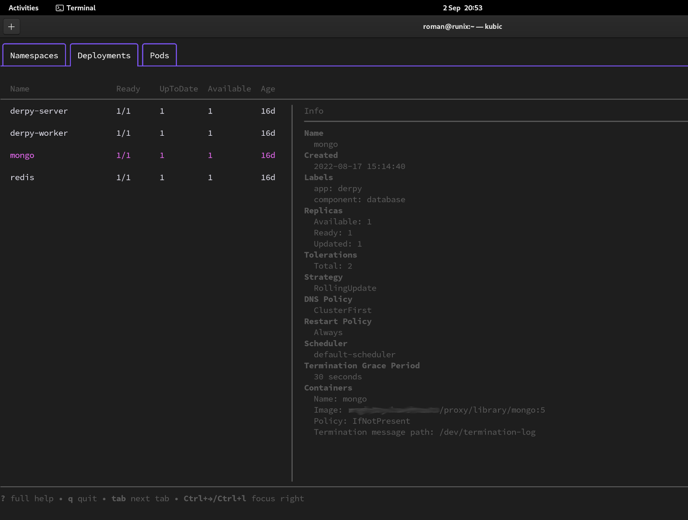
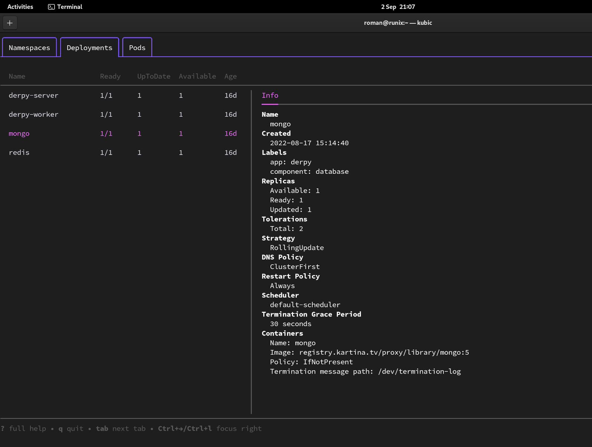

kubic
===

tui for k8s

## What is it.

`kubic` is a tui k8s explorer. 

The idea is to free from the need to keep namespaces, deployments, pods names in your head.

It's a good replacement for kubectl or more precisely it's an additional tool that takes over the most of work.

## Features

- doesn't require configuration for start, just kubernetes config
- vim mappings + arrows for navigation
- simple, sweet design powered by [Charm](https://charm.sh) libraries


## UI screenshots


Different color scheme example.


## Info deployments (implemented with v0.0.2)




## Requirements

- kubernetes `config` file

The best way is to keep it in `~/.kube/config` path. But you can set path on running.

## Installation

### From release

- Download archive from Releases
- Extract archive

```shell
chmod +x kubic
mv kubic ~/.local/bin
```

Unfortunately I don't have apple developer account currently, so binary for mac os have problems with gatekeeper.
Try build manually (next way).

### Build manually

```shell
git clone git@github.com:tty2/kubic.git
```

```shell
go build
```


Put `kubic` binary to your favorite `*/bin` path (Check with `echo $PATH`).

## Run

1. With default config.

 You can run `kubic` without any parameters if you have kubernetes config in `~/.kube/config` path nad need to use it.

```shell
kubic
```

2. With custom config.

You can run it with `--config` or shot `-c` parameter and set path to the config path. Or with environment variable `KUBIC_KUBERNETES_CONFIG_PATH`.

```shell
kubic -c /path/to/the/config/file
```

3. With custom color scheme.

If you want's to use different color scheme, put `style.json` in the same directory with `kubic` binary and run `kubic` without additional parameters. `kubic` will use this file automatically.

You can set path path to your json file with `--theme` parameter (short way `-t`) or with environment variable `KUBIC_THEME_FILE_PATH`.

```shell
kubic -t /path/to/the/json/style/file
```

Flags list:

| Short Flag | Long Flag | Environment Variable| Is Required | Type | Default |
| ---   | --- | --- | --- | --- | --- |
| -c | --config | KUBIC_KUBERNETES_CONFIG_PATH | False | string | |
| -t | --theme | KUBIC_THEME_FILE_PATH | False | string | |
| -l | --log_tail | KUBIC_LOG_TAIL_LINES | False | int | 100 |


## Customization

You can set your own color scheme with json file.

[Example](./assets/style.json)

Classes are predefined. Set your own color with hex.

```json
{
    "main-text": "#ffffff",
    "selected-text": "#61b0de",
    "inactive-text": "#616363",
    "tab-borders": "#109f93",
    "namespace-sign": "#eb24a9"
}
```

***

Powered by [Charm](https://charm.sh).

<a href="https://charm.sh/"></a>