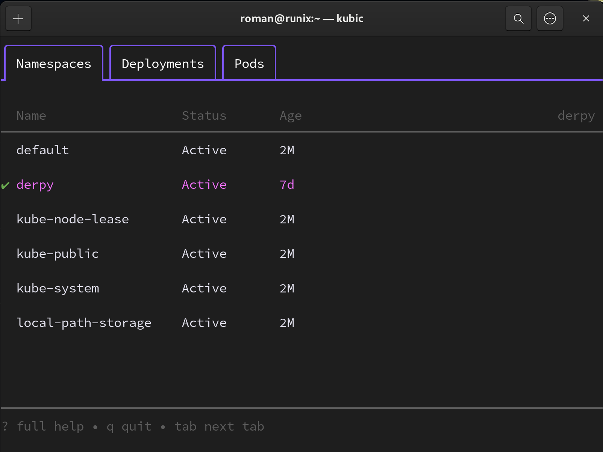
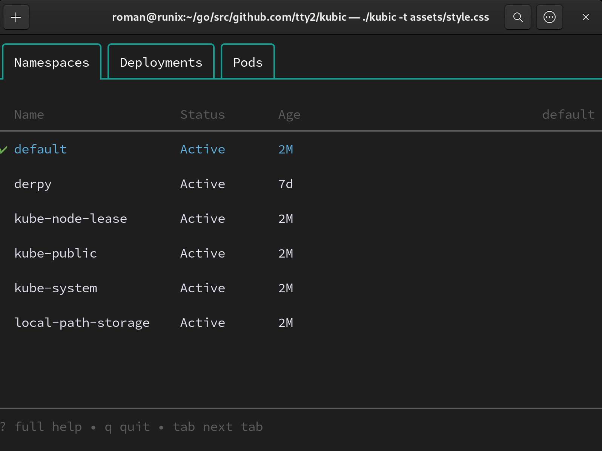
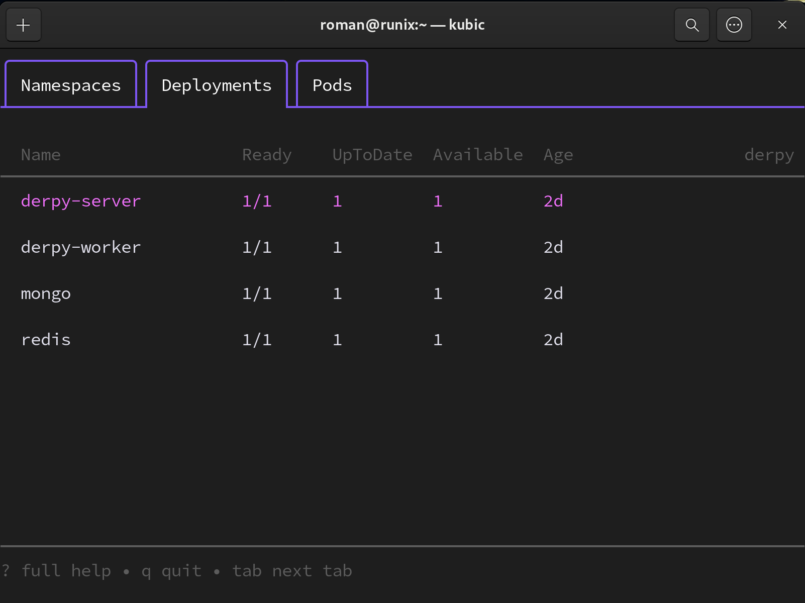
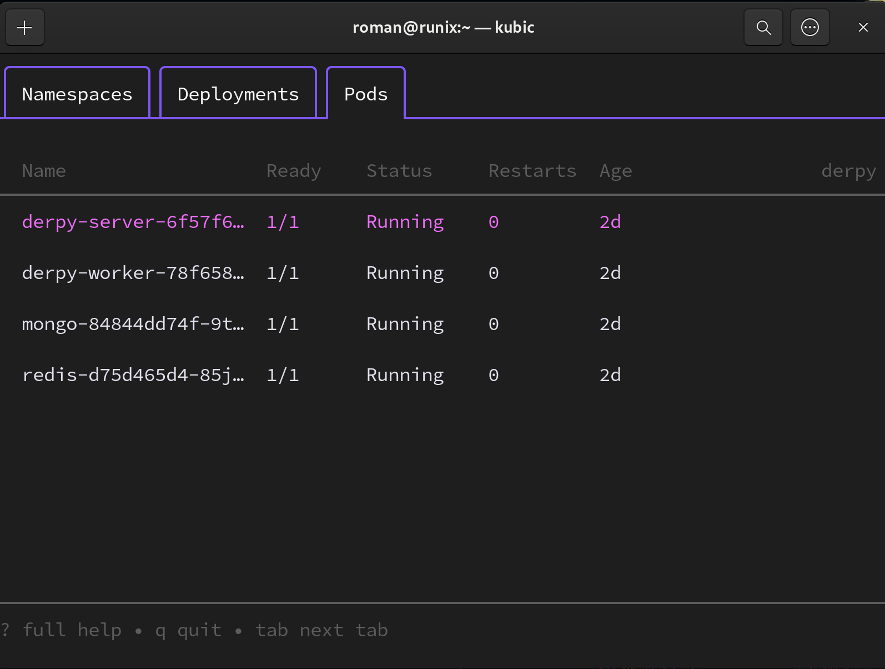

kubic
===

tui for k8s

## What is it.

`kubic` is an tui k8s explorer. 

The idea is to free from the need to keep namespaces, deployments, pods names in memory.

It's a good replacement for kubectl or more precisely it's and additional tool that takes over the most of work.

## Features


## UI






## Requirements

- kubernetes `config` file

The best way is to keep it in `~/.kube/config` path. But you can set path on running from any path.

## Installation

- Download archive from Releases
- Extract archive

```shell
chmod +x kubic
sudo mv kubic ~/.local/bin
```

## Run

1. With default config.

 You can run `kubic` without any parameters if you have kubernetes config in `~/.kube/config` path nad need to use it.

```shell
kubic
```

2. With custom config.

You can run it with `--config` or shot `-c` parameter and set path to the config path. Or with environment variable `KUBIC_KUBERNETES_CONFIG_PATH`.

```shell
kubic -c /path/to/the/config/file
```

3. With custom color scheme.

If you want's to use different color scheme, put `style.css` in the same directory with `kubic` binary and run `kubic` without additional parameters. `kubic` will use this file automatically.

You can set path path to your css file with `--theme` parameter (short way `-t`) or with environment variable `KUBIC_THEME_FILE_PATH`.

```shell
kubic -t /path/to/the/css/style/file
```

Flags list:

| Short Flag | Long Flag | Environment Variable| Is Required | Type |
| ---   | --- | --- | --- | --- |
| -c | --config | KUBIC_KUBERNETES_CONFIG_PATH | False | string |
| -t | --theme | KUBIC_THEME_FILE_PATH | False | string |


## Customization

You can set your own color scheme with css file.

[Example](./assets/style.css)

Classes are predefined. Set your own color with hex.

```css
.main-text {
    color: #ffffff;
}

.selected-text {
    color: #61b0de;
}

.inactive-text {
    color: #616363
}

.tab-borders {
    color: #109f93;
}

.namespace-sign {
    color: #eb24a9;
}
```


***

Powered by [Charm](https://charm.sh).

<a href="https://charm.sh/"></a>